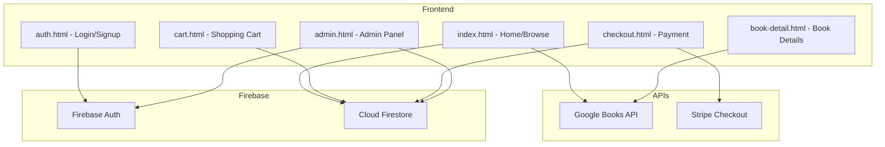
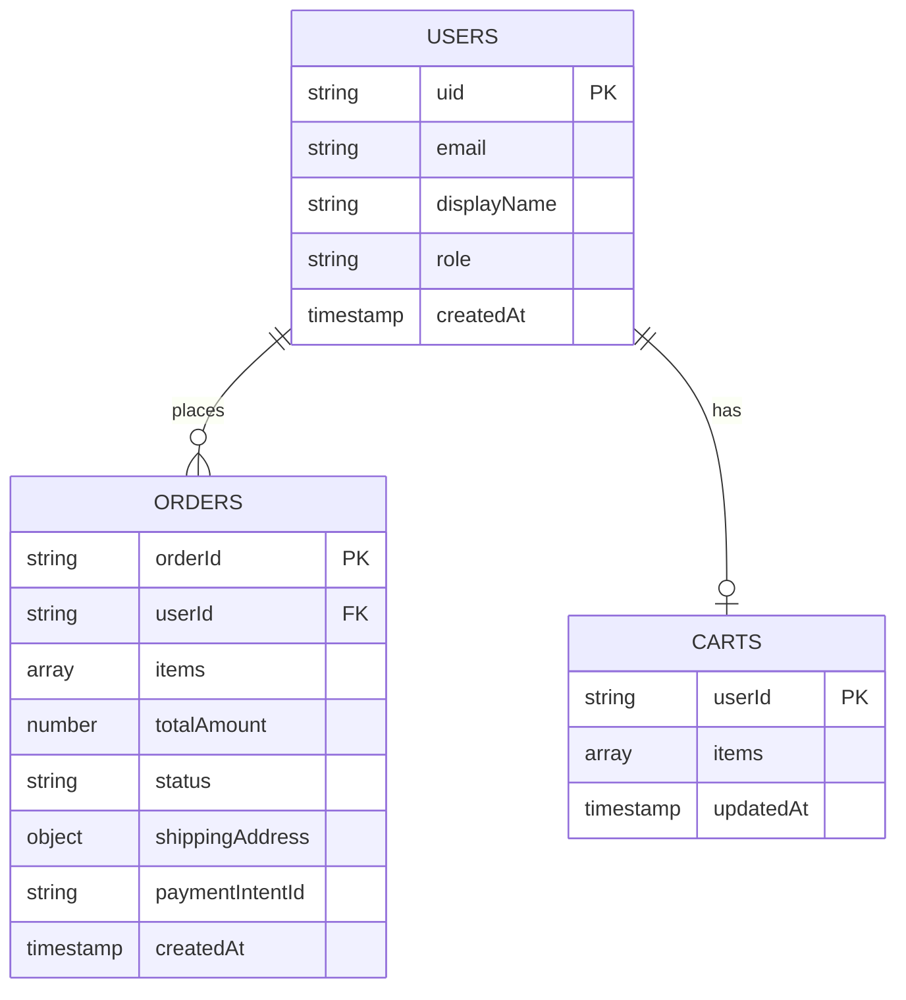
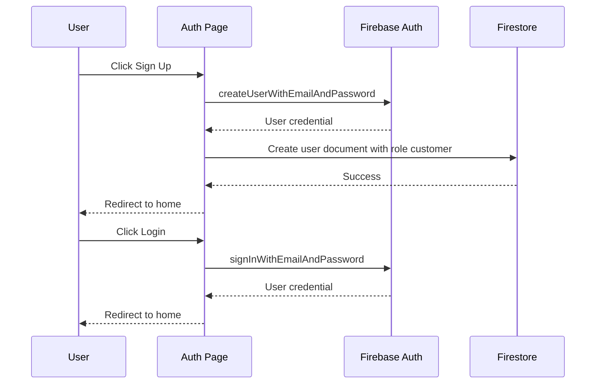

# BookNest - Online Bookstore Architecture Plan

## Overview
Complete rebuild of the current Nike/Adidas athletic store into **BookNest**, a modern online bookstore with authentication, real-time database, book API integration, shopping cart, payments, and admin panel.

## Tech Stack

| Layer | Technology | Purpose |
|-------|-----------|---------|
| Frontend | HTML5, CSS3, Vanilla JS | UI and interactivity |
| Auth | Firebase Authentication | Login, signup, password reset |
| Database | Cloud Firestore | Users, orders, cart persistence |
| Book Data | Google Books API | Book covers, descriptions, metadata |
| Payments | Stripe Checkout | Credit card payments |
| Hosting | Firebase Hosting (optional) | Deployment |

## Architecture Diagram



## Project File Structure

```
ecommerce-website/
├── index.html              # Home page with hero, featured books, search
├── books.html              # Browse all books with filters
├── book-detail.html        # Individual book detail page
├── cart.html               # Shopping cart page
├── checkout.html           # Checkout/payment page
├── auth.html               # Login/Signup page
├── admin.html              # Admin panel for order management
├── css/
│   ├── styles.css          # Global styles and variables
│   ├── components.css      # Reusable component styles
│   └── responsive.css      # Media queries
├── js/
│   ├── firebase-config.js  # Firebase initialization
│   ├── auth.js             # Authentication logic
│   ├── books-api.js        # Google Books API integration
│   ├── cart.js             # Cart functionality
│   ├── checkout.js         # Stripe payment logic
│   ├── admin.js            # Admin panel logic
│   ├── ui.js               # UI helpers and animations
│   └── app.js              # Main app initialization
├── images/
│   └── logo.svg            # BookNest logo
└── plans/
    └── bookstore-plan.md   # This plan
```

## Firestore Database Schema



### Collection Details

**users/**
- `uid` - Firebase Auth UID
- `email` - User email
- `displayName` - Full name
- `role` - "customer" or "admin"
- `address` - Shipping address object
- `createdAt` - Timestamp

**orders/**
- `orderId` - Auto-generated
- `userId` - Reference to user
- `items[]` - Array of: `{ bookId, title, author, thumbnail, price, quantity }`
- `totalAmount` - Total price
- `status` - "pending" | "confirmed" | "shipped" | "delivered"
- `shippingAddress` - Address object
- `paymentIntentId` - Stripe payment reference
- `createdAt` - Timestamp

**carts/**
- `userId` - Document ID = user UID
- `items[]` - Array of: `{ bookId, title, author, thumbnail, price, quantity }`
- `updatedAt` - Timestamp

## Page-by-Page Breakdown

### 1. Home Page - `index.html`
- **Header**: Logo, search bar, nav links, auth button, cart icon with count
- **Hero Section**: Featured book/promotion banner with CTA
- **Categories**: Horizontal scrollable category chips (Fiction, Non-Fiction, Science, History, etc.)
- **Featured Books**: Grid of trending/bestseller books from Google Books API
- **New Arrivals**: Another section with recent books
- **Footer**: Links, newsletter signup, social media

### 2. Browse Books - `books.html`
- **Sidebar Filters**: Category checkboxes, price range slider, rating filter
- **Search Bar**: Real-time search using Google Books API
- **Book Grid**: Cards showing cover, title, author, price, rating
- **Pagination/Load More**: For browsing large results
- **Sort By**: Price, rating, newest

### 3. Book Detail - `book-detail.html`
- Book cover image (large)
- Title, author, publisher, publish date
- Description/synopsis
- Price with add-to-cart button
- Quantity selector
- Category tags
- Related books section

### 4. Auth Page - `auth.html`
- Toggle between Login and Sign Up forms
- Email/password authentication
- Google sign-in button
- Password reset link
- Form validation with error messages

### 5. Shopping Cart - `cart.html`
- List of cart items with thumbnails
- Quantity +/- controls
- Remove item button
- Price subtotal per item
- Cart total
- Proceed to checkout button
- Continue shopping link

### 6. Checkout - `checkout.html`
- Order summary
- Shipping address form
- Stripe payment element
- Place order button
- Order confirmation display

### 7. Admin Panel - `admin.html`
- Protected route (admin role only)
- Dashboard with order stats
- Orders table with status filters
- Order detail view
- Update order status buttons (Confirm, Ship, Deliver)
- Search orders by user/ID

## Google Books API Integration

- **Base URL**: `https://www.googleapis.com/books/v1/volumes`
- **Search**: `?q={query}&maxResults=20`
- **By Category**: `?q=subject:{category}`
- **By ID**: `/{volumeId}`
- **No API key required** for basic usage (rate limited)
- Book prices will be generated since Google Books API doesnt always provide them

### Price Strategy
Since Google Books API doesnt consistently return prices, we will:
1. Use `saleInfo.listPrice` when available
2. Generate a deterministic price based on page count and category when not available
3. Store custom prices in Firestore for admin-set pricing

## Authentication Flow



## Payment Flow with Stripe

For a frontend-only approach, we will use **Stripe Checkout** in client-only mode:
1. User clicks "Place Order"
2. Create Stripe Checkout Session via Stripe.js
3. Redirect to Stripe hosted checkout page
4. On success, redirect back to our site with session ID
5. Save order to Firestore with payment reference

> **Note**: For production, a Cloud Function or server endpoint should create the checkout session. For this project, we will use Stripe Payment Links or client-side redirect as a demo-ready solution.

## Admin Panel Access

- Admin users identified by `role: "admin"` in Firestore
- First admin created manually in Firestore console
- Admin panel checks auth state and role before rendering
- Admin can: view all orders, update order status, see customer details

## UI Design Tokens

```css
/* Color Palette */
--primary: #2563EB        /* Royal Blue */
--primary-dark: #1D4ED8
--secondary: #F59E0B      /* Amber accent */
--bg-primary: #FAFAFA
--bg-card: #FFFFFF
--text-primary: #111827
--text-secondary: #6B7280
--success: #10B981
--error: #EF4444

/* Typography */
--font-main: Inter, system-ui, sans-serif
--font-display: Playfair Display, Georgia, serif  /* For headings */

/* Spacing */
--radius: 12px
--shadow: 0 1px 3px rgba(0,0,0,0.1)
--shadow-lg: 0 10px 25px rgba(0,0,0,0.1)
```

## Animations
- Page transitions with fade-in
- Book cards: hover scale + shadow elevation
- Cart icon: bounce on add-to-cart
- Skeleton loading states for API calls
- Smooth scroll between sections
- Modal slide-in for quick cart preview

## Responsive Breakpoints
- **Desktop**: > 1024px - Full sidebar, 4-column grid
- **Tablet**: 768px - 1024px - Collapsible sidebar, 3-column grid
- **Mobile**: < 768px - Bottom nav, 2-column grid, hamburger menu

## Implementation Order

1. **Project setup** - File structure, Firebase config, CSS variables
2. **Main layout** - Header, nav, footer (shared across pages)
3. **Auth system** - Firebase Auth integration, login/signup pages
4. **Book API** - Google Books API service, data transformation
5. **Home page** - Hero, featured books, categories
6. **Browse page** - Search, filters, book grid
7. **Book detail** - Full book info page
8. **Cart** - Add/remove/update, persistence in Firestore
9. **Checkout** - Stripe integration, order creation
10. **Admin panel** - Order management dashboard
11. **Responsive** - Mobile optimization
12. **Polish** - Animations, loading states, error handling
